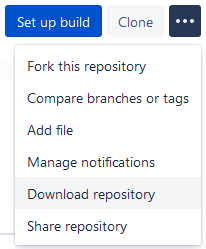

# Aseprite Dithering Matrices

This is an Aseprite [extension](https://github.com/aseprite/aseprite/tree/master/data/extensions) I made after reading [this post](https://community.aseprite.org/t/new-pattern-fill/1627), it's under [MIT License](LICENSE.txt), so feel free to edit and use it as you like :)

### Some Examples ###

These are some examples of the ditherings you can make if you tinker with Dithering Matrices in Aseprite.

### How to Install ###

First of all, download the latest version of this extension. You can do that by clicking on _**Download Repository**_ from [here](https://bitbucket.org/jjhaggar/aseprite-dithering-matrices/src/). That will let you download a .zip file of the complete repository (which will also work as an Aseprite extension).

After that, you have two options:

1.  Use _Edit > Preferences > Extensions > Add Extension_ and select the .zip (this is recommended because then you can _Uninstall_ the extension from the same dialog)
2.  Or you can uncompress the .zip file in a subfolder of the `extensions` folder e.g. `Aseprite/data/extensions/myextension`), this is what the _Add Extension_ button does from the UI (+ creates an extra file for uninstallation)

### How to Create more Dithering Matrices ###

If you want to experiment and create more dithering matrices, you can create an extension (a .zip file or a directory) with a content similar to [this one](https://github.com/aseprite/aseprite/tree/master/data/extensions/bayer-matrices).

In fact, you have a copy of that folder in your Aseprite Extension folder, which you can acces by clicking on _Edit > Preferences > Extensions_, then Select the Extension _Bayer Matrices for Dithering_ and click on _Open Folder_.

First of all you should make a copy of them in another (safe) place. You can then alter the files of that folder in order to see how they work (the changes will apply after you close and open Aseprite again). 

You can open the file _package.json_ with any text editor (I recommend [Notepad++](https://notepad-plus-plus.org/downloads/)), the content is pretty autoexplicative.

And you can open and edit the .bmp files with Aseprite. As you will be able to see when you open them, they have **indexed color**. They need to have an indexed palette to differenciate the "amount of opacity" (not sure about the correct term for this) for gradients and pressure drawing, meaning that the order in the palette's colors is the order in what the increasing "opacity" will be filling the pixels of the matrix.

If you open the bayer2x2.bmp for example, you can see that it has only 4 pixels (2x2) and that the order of these pixels when they are being used for dithering, based in the 4 color indexed palette will be:

[ 1, 2
  3, 4 ]

Not sure if is good enough, but I hope this explanation is of some help if somebody else is trying to create new ditherings. Have fun! :)